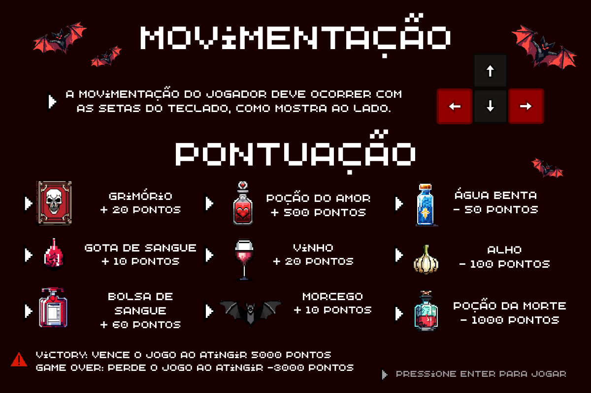
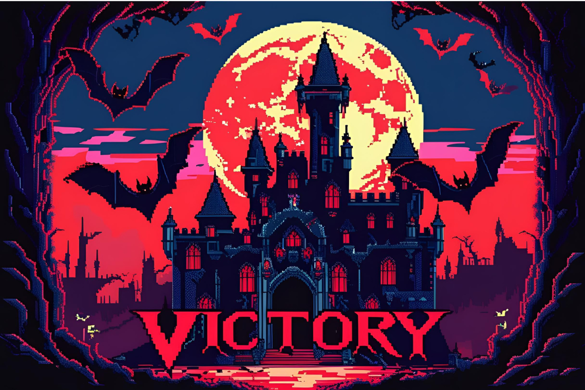
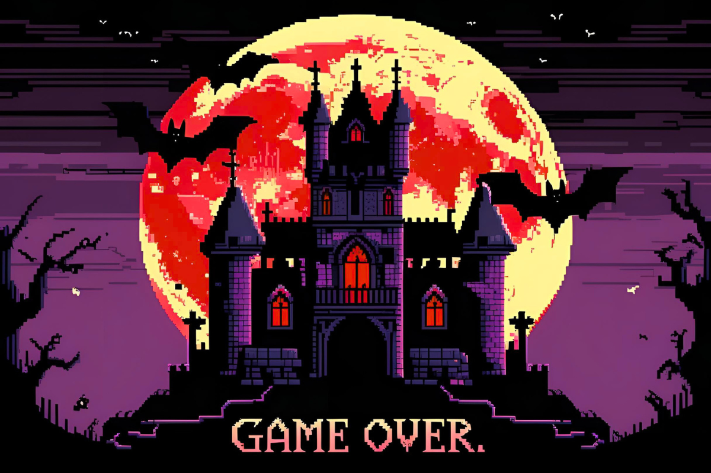

# Lady Morgana

## Objetivo

Lady Morgana é um jogo com a mecânica de **"Pega Item"**. Nele, diversos itens caem da parte superior da tela e o objetivo do jogador é coletar os **obstáculos positivos** e desviar dos **obstáculos negativos**.

## Como jogar?

Ao iniciar o jogo e passar pela capa, você entrará automaticamente na tela de **"Tutorial"**, onde encontrará todas as instruções detalhadas para jogar.

## Como saber se venci ou perdi o jogo?

A tela de vitória ou derrota aparecerá automaticamente assim que a pontuação limite for atingida:

---

## Tecnologias
* Linguagens: Python.

## Bibliotecas
* Pygame

## Instalação e uso
* Clone o repositório ou baixe os arquivos.
* O projeto exige a instalação do Pygame. Para jogar basta apenas executar o arquivo "a_main.py".
  
**ATENÇÃO:** O jogo possui uma temática de vampiros e, portanto, pode ser sensível para alguns usuários.

